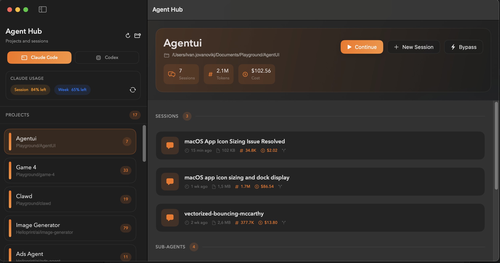

# Agent Hub

A native macOS app for managing Claude Code and OpenAI Codex CLI sessions. Includes a full window interface and menu bar quick access.



## Features

- **Menu bar access** — browse and resume sessions without leaving your workflow
- **Dual agent support** — switch between Claude Code and Codex
- **Session preview** — peek at recent messages before resuming
- **Token stats** — track usage and estimated costs
- **One-click actions** — continue, fork, or start new sessions

## Installation

### Homebrew (recommended)

```bash
brew tap ivan-jovanovic/agent-hub https://github.com/ivan-jovanovic/agent-hub
brew install --cask agent-hub
```

### Manual download

Download the latest `.zip` from [Releases](https://github.com/ivan-jovanovic/agent-hub/releases), extract, and move `Agent Hub.app` to Applications.

### Build from source

```bash
git clone https://github.com/ivan-jovanovic/agent-hub.git
cd agent-hub
./Scripts/setup.sh
```

## Requirements

- macOS 14.0+
- [iTerm2](https://iterm2.com/)
- [Claude Code](https://github.com/anthropics/claude-code) and/or [Codex CLI](https://github.com/openai/codex)

## Contributing

Contributions welcome! See [CLAUDE.md](CLAUDE.md) for architecture details and development notes.

## License

MIT
